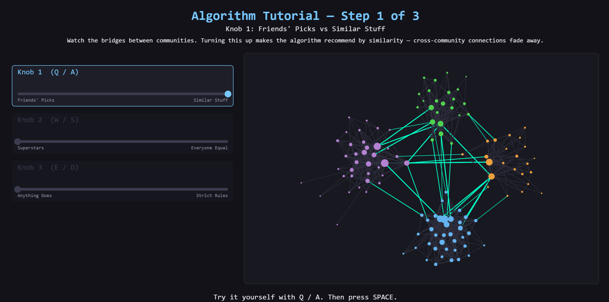

# AlgoWorld

**Design a social-media platform. Then try to go viral on it.**

An interactive educational game for the [Lange Nacht der Forschung](https://www.langenachtderforschung.at/) Graz, built by the [CS² lab](https://www.2squared.at/). Players design a recommendation algorithm, watch a social network emerge from their choices, and then experience firsthand how content spreads — and why virality and user satisfaction aren't the same thing.



---

## How It Works

### 1. Design Your Algorithm

You are TikTok. Three knobs control how your platform's recommendation algorithm works:

| Knob | Left | Right | What it does |
|------|------|-------|--------------|
| **Knob 1** (Q/A) | Friends' Picks | Similar Stuff | Network-based vs. content-based recommendations. Controls how many edges cross community boundaries. |
| **Knob 2** (W/S) | Superstars | Everyone Equal | Hub-driven virality vs. flat visibility. Controls the degree distribution — low values create mega-hubs, high values equalize. |
| **Knob 3** (E/D) | Anything Goes | Strict Rules | No moderation vs. aggressive pruning of controversial bridge nodes. Fragments the network into isolated bubbles. |

A live preview network updates as you adjust the knobs, so you can see your platform's structure take shape before committing.

### 2. Seed Your Posts

Three posts arrive — a **Crowd-Pleaser**, a **Niche Hit**, and a **Hot Take** — each targeting a different animal community. Click a node to drop your post into the network and watch it spread via an [Independent Cascade Model](https://en.wikipedia.org/wiki/Independent_cascade_model).

The four communities (Cats, Dogs, Mice, Birds) have intuitive alliances and rivalries:
- Cats hate dogs, love watching prey (mice + birds)
- Dogs hate cats, chase mice, are outdoor buddies with birds
- Mice fear cats and dogs, ally with birds
- Birds fear cats, like dogs and mice

Placing a post in the right community matters. Drop a cat meme in the dog community and watch the hate-sharing tank your satisfaction score.

### 3. The Platform Map

Your results land on a 2D scatter plot — **reach vs. satisfaction** — placing you in one of four quadrants:

| | High Satisfaction | Low Satisfaction |
|---|---|---|
| **High Reach** | **Echo Paradise** — Everyone agrees. Comfortable — but is anyone being challenged? | **Rage Machine** — Everyone saw it, nobody liked it. Engagement farming at its finest. |
| **Low Reach** | **Cozy Bubble** — Small circles, happy people. But the rest of the world doesn't exist. | **Dead Platform** — Nothing spreads, nobody's happy. Did you even build an algorithm? |

No player "wins" or "loses." Every position tells a story about a real tradeoff in platform design. The map fills up over the exhibition day, becoming a collective visualization of all the platforms Graz built that night.

---

## Running the Game

### Web Version (recommended for exhibition)

Just open `web/index.html` in a browser. No server, no dependencies.

**Kiosk mode for the exhibition** (Brave browser):

```
start_game.bat
```

This launches Brave in fullscreen kiosk mode with no URL bar. Double-click the `.bat` file and walk away.

### Python Version (development)

Requires Python 3 with `pygame` and `numpy`:

```bash
pip install pygame numpy
python main.py
```

---

## Controls

| Key | Action |
|-----|--------|
| Q / A | Knob 1 down / up |
| W / S | Knob 2 down / up |
| E / D | Knob 3 down / up |
| Mouse click | Select seed node |
| Scroll wheel | Zoom network |
| Right-drag | Pan network |
| R | Reset camera |
| F11 | Toggle fullscreen |
| Space | Advance / confirm |

---

## Scientific Background

| Game Mechanic | Scientific Basis |
|---|---|
| Network generation | Stochastic Block Model with power-law degree distribution ([LFR benchmark](https://en.wikipedia.org/wiki/Lancichinetti%E2%80%93Fortunato%E2%80%93Radicchi_benchmark)) |
| Content spreading | Independent Cascade Model (Kempe, Kleinberg, Tardos 2003) |
| Filter bubbles & echo chambers | Pariser (2011), Flaxman et al. (2016) |
| Bridge nodes + controversy | Brady et al. (2017), Bail et al. (2018) |
| Moderation tradeoffs | Jhaver et al. (2021), Chandrasekharan et al. (2017) |

---

## Project Structure

```
.
├── web/                  # Browser version (vanilla JS + Canvas)
│   ├── index.html
│   ├── game.js           # Main game loop, state machine, rendering
│   ├── network.js        # SBM network generation
│   ├── layout.js         # Fruchterman-Reingold force-directed layout
│   ├── cascade.js        # Independent Cascade Model
│   ├── scoring.js        # Reach + satisfaction scoring
│   ├── config.js         # Tunable constants
│   ├── topics.js         # Community definitions + affinity matrix
│   ├── posts.js          # Post pool
│   └── rng.js            # Seeded PRNG
├── main.py               # Pygame version (entry point)
├── network.py            # Python network generation
├── layout.py             # Python FR layout (numpy)
├── cascade.py            # Python ICM
├── scoring.py            # Python scoring
├── config.py             # Python constants
├── topics.py             # Python topics + affinity
├── posts.py              # Python posts
├── analysis.py           # Batch simulation for parameter tuning
└── start_game.bat        # Brave kiosk launcher
```

---

## License

Built for the Lange Nacht der Forschung Graz by the CS² lab, TU Graz.
